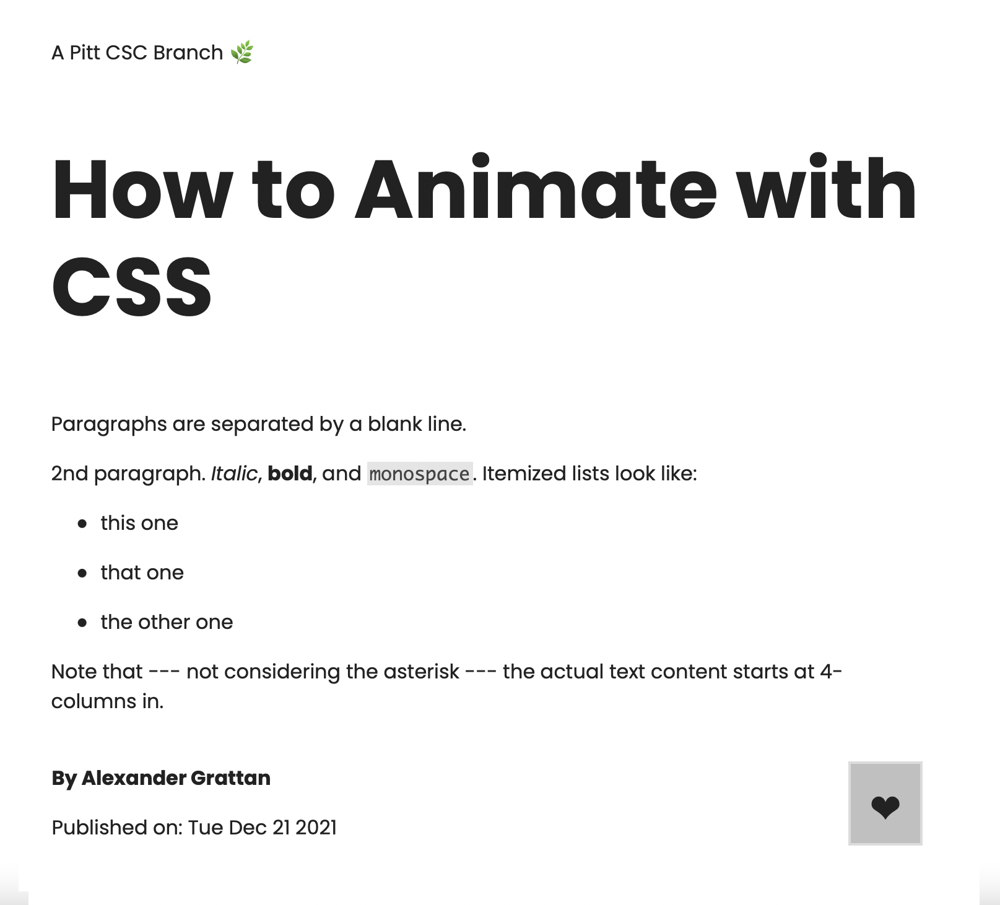

<div style="background-color: white; height: 200px; width: 50%; margin: auto;">
  
</div>

# Table of contents

- [Table of contents](#table-of-contents)
- [Contributing](#contributing)
- [The markdown file](#the-markdown-file)
  - [Resources for markdown files](#resources-for-markdown-files)
- [Submitting a post](#submitting-a-post)
- [Accepting a post](#accepting-a-post)

# Contributing

Contributing to CSC Branches is very simple. All you have to do is create a markdown file (more on this later) and submit a pull requst, basically asking for it to be added to the website.

# The markdown file

The markdown file you submit has to follow a certain format, nothing too weird or complex, just a little pre-formatting. Here's a short sample post, in markdown and rendered:

<table>
  <tr>
    <td>

```Markdown
---
title: How to Animate with CSS
author: Alexander Grattan
---

Paragraphs are separated by a blank line.

2nd paragraph. _Italic_, **bold**, and `monospace`. Itemized lists
look like:

- this one
- that one
- the other one

Note that --- not considering the asterisk --- the actual text
content starts at 4-columns in.
```

  </td>
  <td>
    
  </td>

  </tr>
</table>

The pre-formatting mentioned before consists of assigning each post a `title` and an `author`. These will be used to identify the post and help with backend formatting. After the second set of `---`you may begin writing your post. We'll leave a few sample lines of code as well as resources below that should help with writing your markdown files.

## Resources for markdown files

```markdown
<!-- text -->

text is written on the file, no special tags or funky stuff.
markdown does have whitespace rules, which we'll link below!

# H1 Heading -> this is the largest type of heading assignable

<!-- unordered lists -->

- element 1
- element 2
- element 3

<!-- ordered lists -->

1. element 1
2. element 2
3. element 3
```

Here are some links we found very helpful ourselves:

- [Complete cheatsheet](https://www.markdownguide.org/basic-syntax)

# Submitting a post

# Accepting a post
