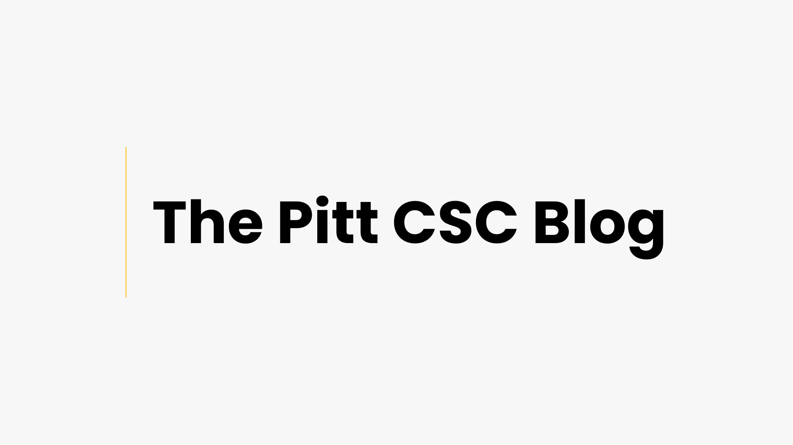
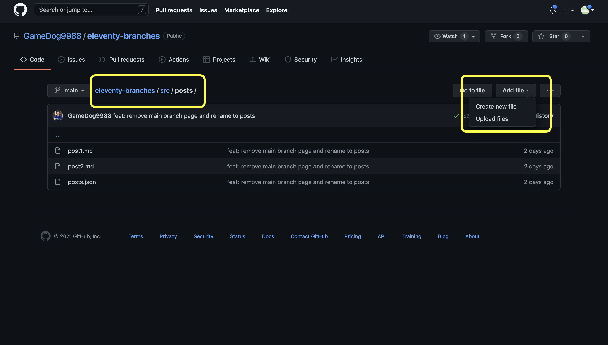
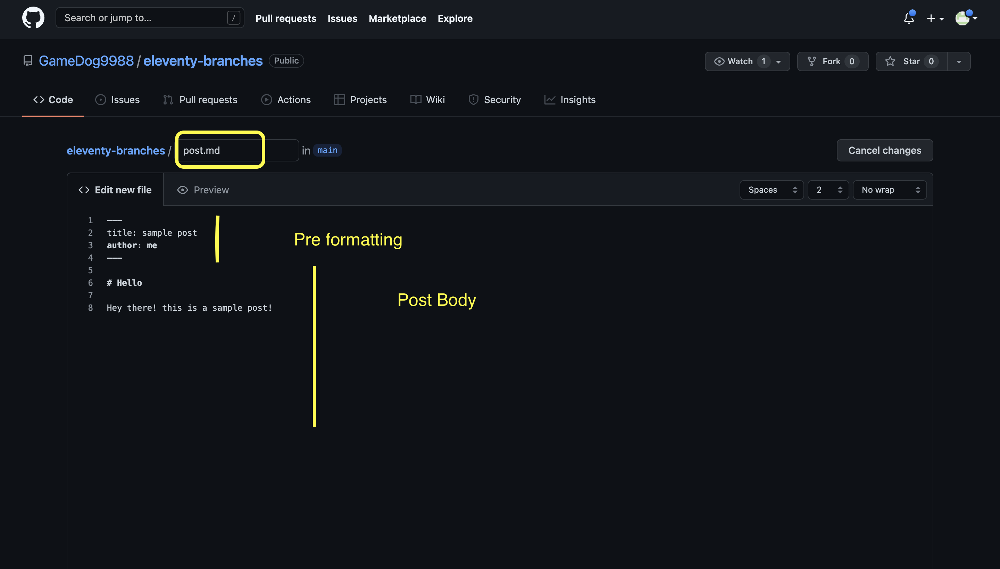
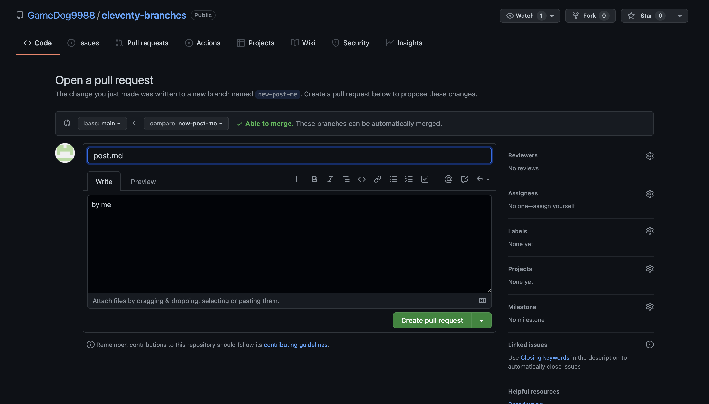
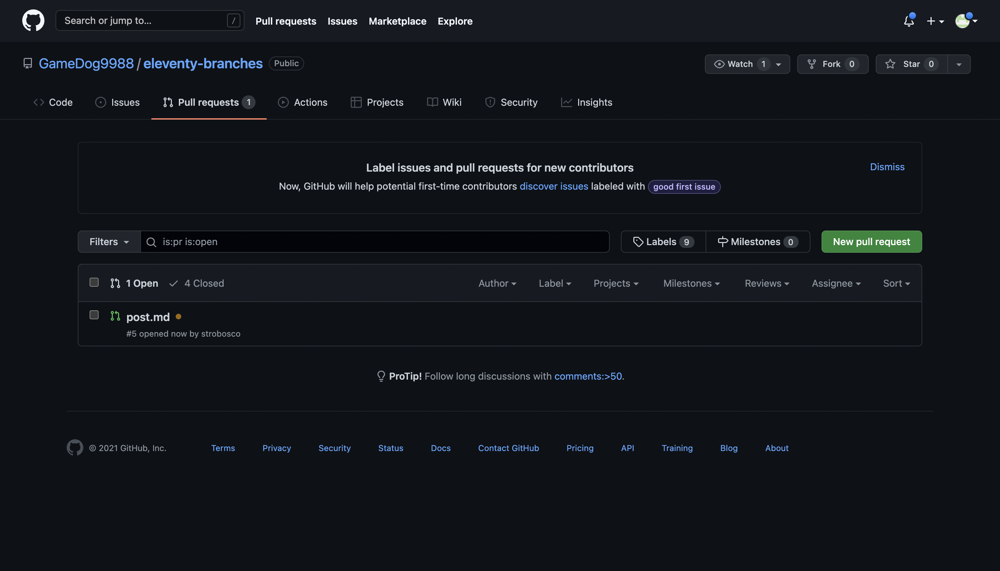
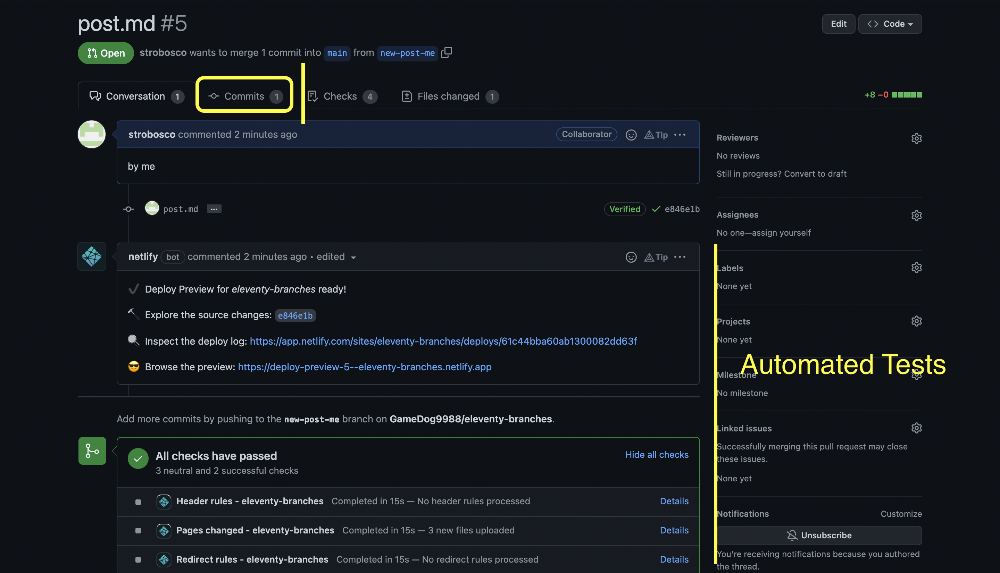
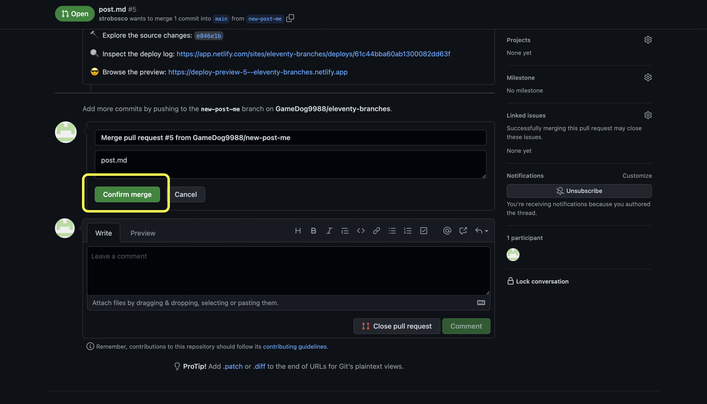
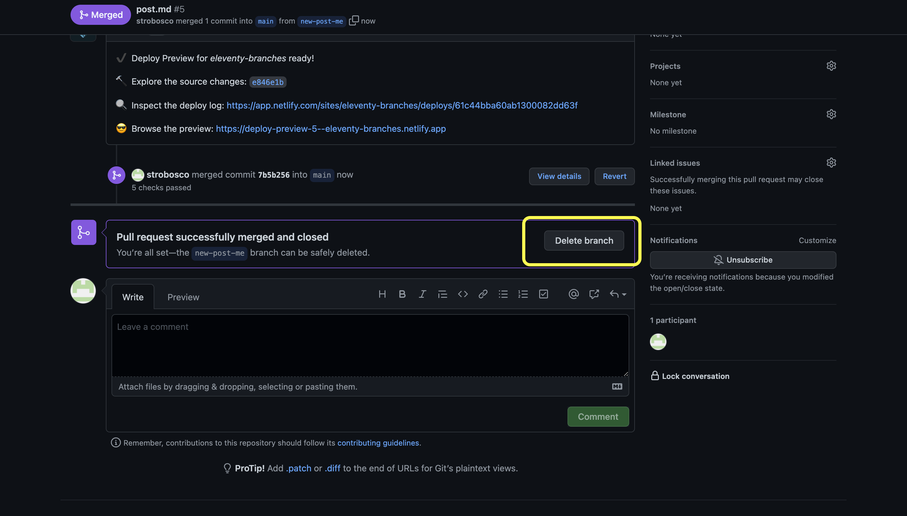

<div style="width: 50%; margin: auto;">
  
</div>

# Table of contents

- [Table of contents](#table-of-contents)
- [Contributing](#contributing)
- [The markdown file](#the-markdown-file)
  - [Resources for markdown files](#resources-for-markdown-files)
- [Submitting a post](#submitting-a-post)
    - [1. Adding a new file](#1-adding-a-new-file)
    - [2. Writing post](#2-writing-post)
    - [3. Committing the file](#3-committing-the-file)
    - [4. Submitting pull request](#4-submitting-pull-request)
- [Accepting a post](#accepting-a-post)
    - [1. Opening pull request](#1-opening-pull-request)
    - [2. Reviewing the post](#2-reviewing-the-post)
    - [3. Merging](#3-merging)

# Contributing

Contributing to CSC Branches is very simple. All you have to do is create a markdown file (more on this later) and submit a pull requst, basically asking for it to be added to the website.

# The markdown file

The markdown file you submit has to follow a certain format, nothing too weird or complex, just a little pre-formatting. Here's a short sample post, in markdown and rendered:

<table>
  <tr>
    <td>

```Markdown
---
title: How to Animate Your Website With GSAP
author: Alexander Grattan
tags: ["web dev"]
date: 2021-12-19
---

## What the Hell is GSAP?

GSAP (GreenSock Animation Platform) is the hallmark JavaScript animation library used on many of the most beatifully animated, award-winning websites. 
Made by [GreenSock](https://greensock.com/), GSAP has an incredibly supportive community as well as a responsive dev team that regularly responds to posts on their [forum](https://greensock.com/forums/forum/11-gsap/) (it has over 100k posts!).

Needless to say, it's a popular library and a great tool to know and have at your disposal.

## Let's Build Something
      
Alright so let's start out with some basic HTML.
```

  </td>
  <td>

  </td>

  </tr>
</table>

The pre-formatting mentioned before consists of assigning each post a `title` and an `author`. These will be used to identify the post and help with backend formatting. After the second set of `---`you may begin writing your post. We'll leave a few sample lines of code as well as resources below that should help with writing your markdown files.

## Resources for markdown files

```markdown
<!-- text -->

text is written on the file, no special tags or funky stuff.
markdown does have whitespace rules, which we'll link below!

# H1 Heading -> this is the largest type of heading assignable

<!-- unordered lists -->

- element 1
- element 2
- element 3

<!-- ordered lists -->

1. element 1
2. element 2
3. element 3
```

Here are some links we found very helpful ourselves:

- [Complete cheatsheet](https://www.markdownguide.org/basic-syntax)

# Submitting a post

The easiest way to submit a post is through [GitHub](https://github.com) by heading over to the branch
repository and following these steps:

### 1. Adding a new file



Just head over to the repositories landing page and navigate to the `src/posts` folder and click on `Add file` and then `Create new file`.

### 2. Writing post



The second step requires you to add a title to your post, which ideally **corresponds to the title of the post**, the **pre formatting**, and the **post body**

- file name (title)
- pre formatting
- post body

### 3. Committing the file


For step 3 you will scroll down to the bottom of the page and:

- add the file name to the first box
- add `by` and then the author name in the second box
- name the pull request as `new-<title>-<author>` (title has no file extension!)

After that click `Propose new file`

### 4. Submitting pull request



The next step is simple, just click on `Create pull request` and you're done!

<div align='center'>
You submitted your first post!!!
</div>

# Accepting a post

The easiest way to accpet a post is through [GitHub](https://github.com) by heading over to the branch
repository and following these steps:

### 1. Opening pull request



Head over to the pull requests tab and identify the post you want to accept. Click on it to open the pull request.

### 2. Reviewing the post



After opening the pull requests you can click on `Commits` to view the post. There should be only one commit and once you click on it the post will be visible. After reviewing it head to the next step.

### 3. Merging


After review scroll down to the bottom of the page and click `Merge pull request`.



Confirm the pull request



and delete the branch.
